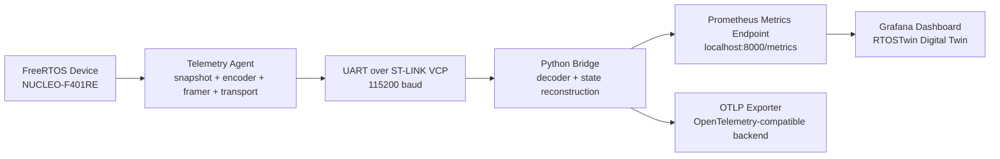
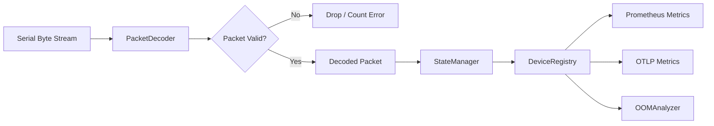
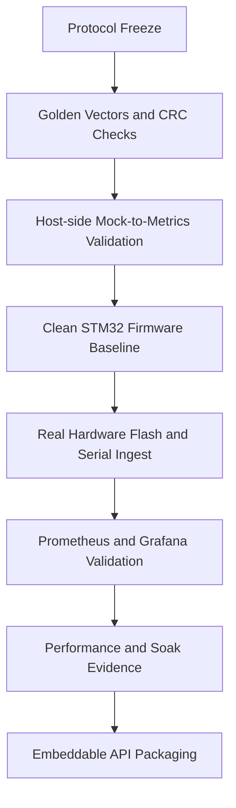
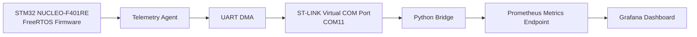

# RTOSTwin

## RTOS Digital Twin and Observability Bridge

**RTOSTwin** is an end-to-end embedded observability system that turns low-level FreeRTOS runtime state inside a microcontroller into a live digital twin visible through the same open observability stack used for cloud and backend systems: **Prometheus, Grafana, and OpenTelemetry**.

At a practical level, this project proves that a small STM32 microcontroller can continuously expose task scheduling state, CPU usage, heap health, stack headroom, packet-loss behavior, and memory-risk trends to a standard metrics pipeline without requiring a proprietary backend, a paid fleet-monitoring service, or a permanently attached debug probe.

This project was built and validated on a real **NUCLEO-F401RE** board running **FreeRTOS**, with a Python bridge on the host side and a full **Prometheus -> Grafana** observability path. It was later refactored into a reusable embeddable module so the telemetry agent can be dropped into another STM32 firmware project as a clean library/API rather than remaining a one-off demo.

---

## Technology Stack

- **Embedded:** `C99`, `FreeRTOS`, `STM32 HAL`, `UART DMA`, `DWT cycle counter`
- **Host bridge:** `Python`, `pyserial`, `pytest`
- **Observability:** `Prometheus`, `Grafana`, `OpenTelemetry OTLP`
- **Platform baseline:** `NUCLEO-F401RE`
- **Architecture style:** embedded telemetry agent + host-side protocol bridge + live metrics dashboard

---

## The Problem This Project Solves

Modern backend and distributed systems are easy to monitor. Teams already know how to inspect CPU, memory, queue depth, latency, and error rates using standardized observability pipelines. An engineer can deploy a service, point Prometheus at it, wire it into Grafana, and immediately understand whether the system is healthy.

Embedded RTOS systems do not usually get that treatment.

A FreeRTOS application may have many tasks, dynamic scheduling behavior, stack watermark risk, heap pressure, and fault patterns that matter deeply in production, but once that firmware is deployed, most teams lose visibility into the operating system itself. During development they may use debug probes, IDE views, tracing tools, or proprietary commercial platforms, but those approaches do not translate cleanly into an open, self-hosted, standards-based monitoring path for deployed devices.

That gap is exactly what RTOSTwin targets.

The thesis behind the project is simple:

> A real RTOS device should be observable with the same open metrics stack used for servers.

That idea drove everything in the system:

- a lightweight MCU-side telemetry agent
- a compact wire protocol with framing, CRC, keyframes, and deltas
- a host-side bridge that reconstructs full device state
- Prometheus metrics and OTLP export
- a Grafana dashboard that acts as a live digital twin for the board

---

## What RTOSTwin Actually Does

RTOSTwin continuously captures RTOS-internal health signals from a running microcontroller, serializes them into a compact binary protocol, transports them over UART, reconstructs the state on the host, and publishes that state as standard observability metrics.

The system tracks:

- task state
- per-task CPU distribution
- total CPU utilization
- heap free bytes
- minimum-ever heap
- stack watermark per task
- telemetry packet loss
- projected out-of-memory risk

This means the microcontroller is no longer a black box. It becomes an observable runtime system with a live operational model.

---

## Core Architecture



The architecture has three major layers:

### 1. MCU Telemetry Agent

Runs inside the embedded firmware alongside the application. Its job is to collect RTOS state with minimal overhead and package it into a stable binary telemetry stream.

### 2. Host-Side Bridge

Runs on a PC or edge machine. It receives the raw serial packets, validates and decodes them, reconstructs full device state from keyframes and deltas, and turns that state into metrics.

### 3. Observability Layer

Prometheus scrapes the bridge, Grafana visualizes the metrics, and OTLP enables export into broader observability systems.

---

## High-Level Data Flow

```mermaid
flowchart TB
    subgraph MCU["MCU Side: Embedded Telemetry Agent"]
        S1[snapshot_capture()<br/>collect RTOS state]
        S2[encoder_encode()<br/>keyframe or delta payload]
        S3[frame_packet()<br/>header + sequence + CRC]
        S4[transport_send()<br/>UART DMA]
        S1 --> S2 --> S3 --> S4
    end

    subgraph HOST["Host Side: Bridge"]
        H1[PacketDecoder<br/>byte stream -> packet]
        H2[StateManager<br/>apply keyframes and deltas]
        H3[DeviceRegistry<br/>track device state]
        H4[Prometheus Exporter]
        H5[OTLP Exporter]
        H6[OOMAnalyzer]
        H1 --> H2 --> H3
        H3 --> H4
        H3 --> H5
        H3 --> H6
    end

    S4 --> H1
```

---

## Embedded Agent Design

The embedded side was designed around one hard constraint: **visibility is only useful if it is cheap enough to leave on.**

That meant the telemetry agent had to:

- avoid dynamic allocation in the hot path
- use fixed/static buffers
- keep CPU cost well below the loop budget
- preserve a stable, testable wire format
- work on a real constrained STM32 target

### Main Agent Responsibilities

The agent performs the following loop:

1. Capture a snapshot of the RTOS state.
2. Encode the snapshot as either a full keyframe or a delta relative to the previous snapshot.
3. Frame the payload with synchronization bytes, metadata, sequence number, timestamp, and CRC.
4. Send the packet through a UART DMA transport.
5. Repeat periodically.

### Why Keyframes and Deltas

A naive design would send the full task and memory state on every cycle. That would waste serial bandwidth and increase CPU cost. RTOSTwin instead uses:

- **keyframes** for full state refresh
- **delta packets** for only what changed

This drastically reduces steady-state bandwidth while preserving correctness and recovery.

### Snapshot Layer

The snapshot engine captures:

- task list
- task state
- task priority
- task stack watermark
- per-task runtime counter
- heap free bytes
- minimum-ever heap
- CPU utilization

This is the point where the project reaches into the RTOS internals and converts them into a structured runtime model.

### Encoder Layer

The encoder decides whether a packet should be:

- a full keyframe
- a compact delta

It also forces a keyframe when topology changes happen, such as task-count changes or task identity changes, so the host never drifts away from the true system state.

### Framing Layer

The framing layer adds:

- synchronization bytes
- protocol version
- packet type
- sequence number
- timestamp
- payload length
- CRC-16-CCITT

This makes the UART stream robust enough to decode continuously on the host without silently accepting corrupt data.

### Transport Layer

The validated transport path is STM32 UART DMA. This gives the agent a low-overhead non-blocking output path suitable for periodic telemetry.

---

## Host Bridge Design

The host bridge is where raw embedded telemetry becomes operational observability.

### Why a Bridge Exists

The MCU should not try to run Prometheus or OpenTelemetry directly. That would be too heavy, too coupled, and inappropriate for a small microcontroller. Instead, the MCU sends a compact binary stream, and the bridge translates that into standard observability formats on a machine that can afford the software stack.

### Bridge Responsibilities

The bridge:

- opens the serial port
- consumes the byte stream
- reassembles valid framed packets
- verifies CRC and packet structure
- reconstructs full device state from keyframes and deltas
- tracks devices by `device_id`
- exposes current state as Prometheus metrics
- optionally exports the same state through OTLP
- runs OOM trend analysis on heap behavior

### State Reconstruction

The bridge does not treat every packet as a standalone record. It maintains a live model of the device and updates that model incrementally as packets arrive.

That means the host always knows the current state of:

- task set
- task CPU distribution
- task stack headroom
- heap status
- health indicators like packet loss and memory-risk projection

---

## Bridge State Model



This separation matters because it gives the system clear boundaries:

- **decoder** handles protocol correctness
- **state manager** handles semantic reconstruction
- **device registry** handles multi-device state ownership
- **exporters** handle observability output
- **analyzer** handles higher-level diagnosis

---

## OOM Analyzer

One of the strongest ideas in the project is that it does not stop at passive monitoring. It performs interpretation.

The bridge includes an **OOMAnalyzer** that studies heap behavior over time and estimates memory-risk trends. The point is not just to show a heap number, but to answer a more operational question:

> Is this device slowly dying from a leak, or is it stable?

The analyzer was validated against:

- stable mock workloads
- controlled leaking mock workloads
- saturated but non-leaking workloads
- OTLP export scenarios
- the real STM32 hardware lane

This turns the project from a pure telemetry pipe into a runtime health-analysis tool.

---

## Why the Project Is Technically Interesting

RTOSTwin is not just a dashboard wrapper around an embedded demo. The engineering value comes from the fact that it had to solve several hard problems simultaneously:

- how to observe RTOS state inside a small MCU
- how to keep the telemetry overhead low enough to be practical
- how to serialize that state into a compact stable protocol
- how to recover and maintain correctness across keyframes and deltas
- how to bridge embedded runtime data into open observability standards
- how to validate the whole thing on a real board rather than staying in a simulated lane

The project also had to be honest about evidence. It was not enough to say “the architecture makes sense.” The pipeline had to be measured and proven.

---

## Validation Strategy

The project was intentionally validated in layers:



This staged approach matters because it reduced risk:

- protocol work came first
- decoder correctness came before hardware dependence
- host observability came before real-board proof
- real hardware proof came before performance closure claims
- packaging into an embeddable API came after the validated baseline was stable

---

## Real Hardware Baseline

The primary validated hardware lane is:

- **Board:** `NUCLEO-F401RE`
- **Firmware project:** `RTOSTwinF401RE_clean`
- **Serial path:** `STMicroelectronics STLink Virtual COM Port (COM11)`
- **Bridge command:** `python bridge/main.py --port COM11 --baud 115200 --device-id nucleo-f401re`

This is important because it proves the project is not only a local mock or simulation pipeline. It was actually built, flashed, run, ingested, and visualized on real hardware.

---

## The Exact Hardware-to-Dashboard Pipeline That Was Proven



The validated milestone was:

> `NUCLEO-F401RE -> FreeRTOS telemetry firmware -> ST-LINK virtual COM port -> Python bridge -> Prometheus -> Grafana`

That end-to-end path is the central proof point of the project.

---

## Metrics the System Exposes

The live metrics include:

- `rtos_cpu_utilization_ratio`
- `rtos_task_cpu_ratio`
- `rtos_heap_free_bytes`
- `rtos_heap_min_ever_bytes`
- `rtos_task_stack_watermark_bytes`
- `rtos_task_state`
- `rtos_telemetry_packet_loss_ratio`
- `rtos_heap_oom_projection_seconds`

These metrics are meaningful because they cover both:

- **immediate runtime state**
- **operational risk indicators**

For example:

- CPU tells you whether the scheduler still has headroom
- stack watermark tells you whether a task is approaching overflow
- heap metrics reveal pressure and fragmentation behavior
- OOM projection tells you whether the memory pattern looks stable or leak-like
- packet loss tells you whether the telemetry path itself can be trusted

---

## Measured Results

This is where the project moves from “interesting architecture” to “credible engineering system.”

### 1. Cadence

The validated telemetry cadence on STM32 was:

- **Measured cadence:** `9.52 Hz`
- **Target cadence:** `10 Hz`
- **Measurement window:** `63 seconds`
- **Packet-count delta:** `600 packets`
- **Packet integrity during measurement:** `drops=0`, `seq_gaps=0`

This matters because it shows the periodic telemetry loop ran at the intended operational rate without losing integrity.

### 2. CPU Overhead

The validated telemetry-cycle overhead on STM32 was:

- **Telemetry-cycle mean cycles:** `72987`
- **Mean telemetry-cycle time:** `868.9 us`
- **CPU overhead at 10 Hz:** `0.869%`

The project’s acceptance target was below `2%`, so this result passed with strong headroom.

This is one of the most important numbers in the system because embedded observability only becomes viable if it is cheap enough to keep on continuously.

### 3. Snapshot Cost

Measured snapshot-capture statistics:

- **Snapshot min cycles:** `58644`
- **Snapshot max cycles:** `70770`
- **Snapshot mean cycles:** `58998`

This shows that even the actual state-capture portion remained within a controlled budget on the validated hardware baseline.

### 4. Static RAM Footprint

Measured agent-specific static RAM:

- **Agent `.data` bytes:** `0`
- **Agent `.bss` bytes:** `2543`
- **Agent static RAM total:** `2543 bytes`

The project target was below `10 KB`, so the validated baseline passed that requirement comfortably.

### 5. Dynamic Allocation Audit

The telemetry hot path passed the no-allocation audit:

- no `malloc`
- no `calloc`
- no `realloc`
- no `free`
- no `pvPortMalloc`
- no `pvPortFree`

That matters because dynamic allocation in the hot path would have made the timing and memory behavior far less trustworthy.

### 6. Real Hardware Build Evidence

The successful firmware build produced:

```text
text = 32936
data = 108
bss = 23388
total dec = 56432
```

This confirmed that the real telemetry firmware was built and linked into the embedded image rather than staying in a partial or placeholder state.

---

## Real Hardware Runtime Evidence

The bridge opened the board successfully at:

- `COM11 @ 115200`

Representative bridge logs from the validated run:

```text
110 packets received | drops=0 | seq_gaps=0
208 packets received | drops=0 | seq_gaps=0
```

The packet count continued upward into the thousands with no observed gaps or drops. That is an extremely important proof point because it shows:

- framing correctness
- CRC correctness
- serial transport stability
- decoder correctness
- host-side state continuity

all at once.

---

## Actual Live Metric Values Observed on Real Hardware

Representative values recorded during the validated STM32 run:

- `rtos_cpu_utilization_ratio = 1`
- `rtos_heap_free_bytes = 12568`
- `rtos_heap_min_ever_bytes = 12568`
- `rtos_telemetry_packet_loss_ratio = 0`
- `rtos_heap_oom_projection_seconds = -1`

Per-task telemetry was confirmed for:

- `IDLE`
- `TelemetryTask`
- `defaultTask`
- `Tmr Svc`

Confirmed task stack watermark values:

- `IDLE = 424 B`
- `TelemetryTask = 1560 B`
- `Tmr Svc = 856 B`
- `defaultTask = 344 B`

Interpretation:

- CPU accounting flowed end to end
- heap was stable
- no leak trend was detected in the validated hardware run
- telemetry packet loss stayed at zero
- task-level telemetry was visible and meaningful

---

## Long-Duration Soak Validation

The STM32 baseline was not only measured in a short run. It was also subjected to a long-duration soak test.

### Soak Metadata

- **Date:** `2026-05-12`
- **Start time:** `2026-05-12 03:06:58`
- **End time:** `2026-05-12 11:12:40`
- **Duration:** `8 hours 5 minutes 42 seconds`
- **Board:** `NUCLEO-F401RE`
- **Firmware project:** `RTOSTwinF401RE_clean`
- **Bridge path:** `D:\digital_twin\vnv_final\bridge\main.py`
- **Port:** `COM11`

### Soak Outcomes

- bridge remained alive through the run
- firmware remained alive through the run
- `drops=0`
- `seq_gaps=0`
- `rtos_telemetry_packet_loss_ratio = 0.0`
- `rtos_heap_oom_projection_seconds = -1.0`
- `rtos_heap_free_bytes = 12568.0`
- metric snapshots captured: `97`

This is one of the strongest engineering achievements in the project because it shows the system remained stable over time, not just for a quick demo window.

The compact metrics summary remained stable across the soak window:

```text
rtos_heap_oom_projection_seconds{device_id="nucleo-f401re"} = -1.0
rtos_telemetry_packet_loss_ratio{device_id="nucleo-f401re"} = 0.0
rtos_heap_free_bytes{device_id="nucleo-f401re"} = 12568.0
```

That means:

- no memory leak trend emerged
- transport stability held
- the system retained a stable free-heap signature throughout the sampled soak period

---

## Objective 2: Bridge Export Closure

The project also validated the host-side export layer, not just the embedded telemetry generation.

The bridge path was proven to export RTOS metrics through:

- **Prometheus**
- **OTLP / OpenTelemetry**

This was validated for both:

- mock-device lane
- real STM32 hardware lane

The OTLP-enabled validation confirmed the expected RTOS metric families were exported:

- `rtos.heap.free_bytes`
- `rtos.heap.min_ever_bytes`
- `rtos.heap.oom_projection_seconds`
- `rtos.cpu.utilization_ratio`
- `rtos.telemetry.packet_loss_ratio`
- `rtos.task.state`
- `rtos.task.stack_watermark`
- `rtos.task.cpu_ratio`

This matters because it proves the project is not only a Grafana demo. It is aligned to open observability standards and can integrate with broader metrics ecosystems.

---

## Objective 3: OOM Analyzer Validation

The OOM analyzer was tested across multiple scenarios:

- stable system
- leaking system
- saturated but non-leaking system
- OTLP export path
- real STM32 hardware

Key outcomes:

- analyzer test suite passed `5/5`
- stable mock path remained at `-1.0`
- leak path produced a positive projected OOM value of `1193.3716085975489`
- saturated mock stayed stable at `-1.0`
- real hardware remained stable at `-1.0`

This is powerful because it shows the bridge is not merely forwarding numbers. It is beginning to reason about runtime health.

---

## Embeddable Library / API Migration

After the validated STM32 baseline was closed, the project was migrated into an embeddable module so it could be integrated into another STM32 firmware project cleanly.

The new public API exposes a stable lifecycle surface:

- `rtostwin_init()`
- `rtostwin_start()`
- `rtostwin_stop()`
- `rtostwin_is_running()`
- `rtostwin_version()`

It also preserves backward compatibility through:

- `StartTelemetryAgent()`

And it supports compile-time feature removal through:

- `RTOSTWIN_ENABLE = 0`

This is important because it upgrades the project from a validated system demo into a reusable firmware component.

### Embeddable Architecture

```mermaid
flowchart TB
    A[Application Firmware] --> B[rtostwin.h<br/>public API]
    B --> C[rtostwin_init()]
    B --> D[rtostwin_start()]
    B --> E[rtostwin_stop()]
    C --> F[Lifecycle Module<br/>rtostwin.c]
    D --> F
    E --> F
    F --> G[Snapshot / Encoder / Framer / Transport Core]
```

This migration means a consumer firmware project can:

- include `rtostwin.h`
- provide `rtostwin_config.h`
- call the lifecycle API
- compile the telemetry feature out if needed
- preserve the validated bridge and wire-format behavior

That makes the project significantly stronger from a product and open-source perspective.

---

## Why the Open-Standards Angle Matters

Many embedded observability solutions are tied to proprietary backends or vendor-specific tooling. RTOSTwin was intentionally built around open standards and composability.

That means:

- the MCU remains lightweight
- the host-side bridge is understandable and modifiable
- the metrics are exposed in widely recognized forms
- teams can adopt the project without being trapped in a vendor platform

This is what makes the project interesting not only as firmware work, but as infrastructure and systems design work.

---

## Engineering Trade-Offs the Project Solved

This project is fundamentally a trade-off exercise between observability richness and embedded cost.

It had to balance:

- **fidelity vs. bandwidth**
- **visibility vs. CPU overhead**
- **state richness vs. RAM usage**
- **correctness vs. serial simplicity**
- **embedded minimalism vs. host-side feature depth**

The measured results show those trade-offs landed well on the STM32 baseline:

- telemetry remained near the 10 Hz target
- CPU cost stayed under 1%
- static RAM stayed at 2543 bytes
- no dynamic allocation was introduced into the hot path
- packet integrity remained stable in real hardware and soak evidence

That is the real technical story of RTOSTwin.

---

## Why This Project Matters

RTOSTwin matters because it connects two worlds that are usually separated:

- the world of tiny resource-constrained embedded systems
- the world of modern open observability infrastructure

Instead of treating firmware as something that can only be debugged locally with probes and IDE windows, RTOSTwin treats the embedded runtime like an operational system that deserves the same level of continuous insight as backend services.

That is a strong systems idea.

It is also a strong implementation achievement because the project did not stop at:

- protocol design
- local mock simulation
- pretty dashboards

It went all the way through:

- clean protocol definition
- host-side decoder and exporters
- real STM32 firmware integration
- ST-LINK flashing
- live serial ingest
- Prometheus export
- Grafana visualization
- performance measurement
- long-duration soak validation
- reusable public API packaging

---

## Final Outcome

RTOSTwin successfully demonstrated that a FreeRTOS-based STM32 microcontroller can be turned into a live digital twin visible through Prometheus, Grafana, and OpenTelemetry without requiring proprietary infrastructure.

The most important proven path in the project is:

> `NUCLEO-F401RE -> FreeRTOS telemetry firmware -> ST-LINK virtual COM port -> Python bridge -> Prometheus -> Grafana`

And the most important measured results are:

- **Cadence:** `9.52 Hz`
- **CPU overhead:** `0.869%`
- **Static RAM:** `2543 bytes`
- **Dynamic allocation in hot path:** `none`
- **Packet stability:** `drops=0`, `seq_gaps=0`
- **Soak duration:** `8 hours 5 minutes 42 seconds`
- **Heap stability during soak:** stable at `12568.0`
- **OOM projection during soak:** stable at `-1.0`

The result is a project that is:

- technically deep
- systems-oriented
- hardware-validated
- quantitatively measured
- reusable as an embeddable module
- and directly aligned with real-world observability engineering

---

## Short Portfolio Summary

If I had to summarize RTOSTwin in one paragraph:

> RTOSTwin is a full-stack embedded observability platform that captures live FreeRTOS runtime state on an STM32 microcontroller, compresses and transports that state over a custom telemetry protocol, reconstructs the device model on a Python bridge, and exposes the result as Prometheus and OpenTelemetry metrics powering a live Grafana digital twin. It was validated end to end on real NUCLEO-F401RE hardware, achieved `9.52 Hz` telemetry at only `0.869%` CPU overhead with `2543 bytes` static RAM and zero hot-path allocation, passed an `8+ hour` soak run with `0 drops` and `0 sequence gaps`, and was later packaged as a reusable embeddable firmware library/API for integration into other STM32 projects.
