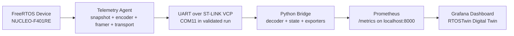
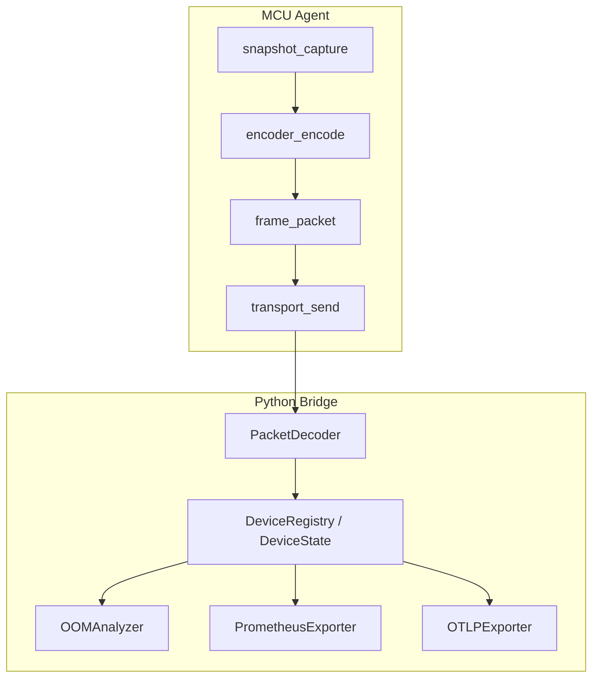

# RTOSTwin
## RTOS Digital Twin and Observability Bridge

RTOSTwin is an embedded observability system for FreeRTOS. It captures RTOS
runtime state on a microcontroller, transports that telemetry to a host-side
Python bridge, exports the decoded state as Prometheus metrics, and visualizes
the result in Grafana.

The primary validated platform is the `NUCLEO-F401RE`. As of `2026-05-10`, the
baseline path from real firmware on a real board to a live Grafana dashboard
has been validated end to end.

For the STM32 baseline, Objective 1 evidence now includes:

- measured cadence: `9.52 Hz`
- measured telemetry-cycle CPU overhead: `0.869%`
- measured agent static RAM: `2543 bytes`
- passing no-allocation hot-path audit

Saved screenshots and terminal captures for this evidence are collected under
[evidence/objective1_stm32](/D:/digital_twin/evidence/objective1_stm32).

Planned expansion targets:

- `ESP32-P4`
- `Teensy 4.1`

## Current Validation Status

The project can honestly claim the following today:

- the baseline `NUCLEO-F401RE -> ST-LINK virtual COM port -> Python bridge ->
  Prometheus -> Grafana` path is validated on real hardware
- the validated STM32 firmware baseline is `RTOSTwinF401RE_clean`
- the clean bridge and dashboard delivery lane is `vnv_final/`
- the legacy root runtime stack has been archived so the active implementation
  path is no longer split across two parallel locations
- live RTOS metrics are flowing for CPU, per-task CPU, heap, stack watermark,
  packet loss, task state, and OOM projection

The project should not yet overclaim the following:

- that `ESP32-P4` and `Teensy 4.1` are validated to the same level
- that every historical STM32 project folder in the repo is part of the final
  validated path
- that long-duration soak, WCET, overhead, and stress characterization are
  fully complete

## Why RTOSTwin Exists

Modern backend and cloud systems are easy to monitor with the open
observability stack: `Prometheus`, `Grafana`, and `OpenTelemetry`. Embedded
FreeRTOS systems usually do not have that same path once they are deployed in
the field.

RTOSTwin exists to close that gap.

It gives embedded systems teams a way to expose RTOS-internal health signals
through the same kind of metrics pipeline that server and infrastructure teams
already use:

- task states
- per-task CPU distribution
- overall CPU utilization
- heap health
- stack headroom
- telemetry packet loss
- projected out-of-memory risk

## What RTOSTwin Does

RTOSTwin has three main pieces:

1. A microcontroller-side telemetry agent written in C for FreeRTOS
2. A host-side Python bridge that decodes packets and maintains device state
3. A Prometheus and Grafana observability path for metrics and dashboards

At a practical level, the system does the following:

- captures RTOS task, heap, stack, and runtime signals on the MCU
- encodes telemetry as framed binary packets
- transports packets over UART on the baseline STM32 path
- decodes packets on the host
- reconstructs full device state from keyframes and deltas
- exports metrics to Prometheus
- renders a digital twin dashboard in Grafana

## Validated Baseline and Planned Targets

| Platform | Status | Notes |
|---|---|---|
| `NUCLEO-F401RE` | Validated | Primary baseline, real hardware path proven end to end |
| `ESP32-P4` | Planned | Future target after baseline hardening |
| `Teensy 4.1` | Planned | Future target after baseline hardening |

The validated firmware project to keep is:

- `RTOSTwinF401RE_clean`

Historical STM32 bring-up projects that should be treated as obsolete or
superseded:

- `RTOSTwinF401RE`
- `textCubeProject`
- `First`

## Architecture

### System Pipeline



### Component Flow



### Runtime Roles

- `snapshot_capture()` collects RTOS state from the running firmware
- `encoder_encode()` converts snapshots into keyframes or deltas
- `frame_packet()` adds sync bytes, metadata, and CRC
- `transport_send()` transmits the packet over the active transport
- `PacketDecoder` reconstructs validated packets from the byte stream
- `DeviceRegistry` and device state tracking keep the current model of each
  observed device
- `PrometheusExporter` exposes the metrics endpoint
- `OOMAnalyzer` projects memory-risk trends from heap behavior

## Real Hardware Validation

The most important project milestone is now complete:

> the full `NUCLEO-F401RE -> FreeRTOS telemetry firmware -> ST-LINK virtual COM
> port -> Python bridge -> Prometheus -> Grafana` path has been validated on
> real hardware as of `2026-05-10`

Validated hardware facts include:

- firmware built successfully with telemetry linked into
  `RTOSTwinF401RE_clean`
- firmware flashed successfully through ST-LINK
- Windows exposed `STMicroelectronics STLink Virtual COM Port (COM11)`
- the bridge decoded packets continuously with `drops=0` and `seq_gaps=0`
- Prometheus exposed live RTOS metrics for `device_id="nucleo-f401re"`
- Grafana rendered live CPU, heap, stack, packet-loss, and OOM-projection data
- the STM32 Objective 1 closure measurements were captured and archived in
  `evidence/objective1_stm32/`

Representative validated bridge command:

```bash
python bridge/main.py --port COM11 --baud 115200 --device-id nucleo-f401re
```

Detailed validation records:

- [Master milestone record](docs/reports/RTOSTwin_Master_Milestone_Record.md)
- [Hardware validation report](vnv_final/docs/reports/hardware_validation_2026-05-10.md)
- [Current VNV verification boundary](vnv_final/docs/vnv_repo_completion_status.md)

## Metrics Exposed

The current system exposes RTOS-focused metrics including:

- `rtos_cpu_utilization_ratio`
  Current overall CPU accounting ratio
- `rtos_task_cpu_ratio`
  Per-task CPU distribution
- `rtos_heap_free_bytes`
  Current free heap
- `rtos_heap_min_ever_bytes`
  Lowest observed free heap since boot
- `rtos_task_stack_watermark_bytes`
  Remaining stack headroom per task
- `rtos_task_state`
  Task execution state metrics
- `rtos_telemetry_packet_loss_ratio`
  Observed packet-loss signal on the telemetry path
- `rtos_heap_oom_projection_seconds`
  Projected time to out-of-memory when a leak trend is detected

What these metrics are for:

- CPU metrics help reveal load distribution and idle slack
- heap metrics show memory pressure and leak behavior
- stack watermark metrics help identify overflow risk
- task-state metrics show blocked, running, or unhealthy scheduling behavior
- packet-loss metrics help determine whether the transport can still be trusted

## Quick Start

The current validated workflow lives in `vnv_final/`.

### 1. Start in the validated subtree

```bash
cd vnv_final
```

### 2. Start Prometheus and Grafana

```bash
docker-compose up -d
```

Endpoints:

- Grafana: `http://localhost:3000`
- Prometheus: `http://localhost:9090`
- Metrics endpoint served by the bridge: `http://localhost:8000/metrics`

### 3. Install Python dependencies

```bash
pip install -r bridge/requirements.txt
```

### 4. Run the local mock demo

This path is useful when you want to exercise the bridge without connecting the
board:

```bash
python bridge/mock_device.py --mode leak | python bridge/main.py --port stdin --device-id mock-stdin
```

### 5. Run the validated real-hardware path

```bash
python bridge/main.py --port COM11 --baud 115200 --device-id nucleo-f401re
```

If your machine enumerates the board on a different COM port, replace `COM11`
with the actual ST-LINK virtual COM port exposed by Windows.

Full quick-start details:

- [Validated quick start](vnv_final/docs/quick_start.md)

## Repository Layout

The repository contains both canonical project-level documents and the current
validated delivery lane:

```text
digital_twin/
|-- README.md
|-- agent/
|   |-- README.md
|   `-- core/
|       `-- wire_format.h
|-- archive/
|   `-- legacy/
|       `-- root-runtime-snapshot-2026-05-10/
|-- docs/
|   |-- reports/
|   |   |-- RTOSTwin_Master_Milestone_Record.md
|   |   |-- Project_Journey_So_Far.md
|   |   `-- RTOSTwin_Complete_Report.md
|   `-- quick_start.md
|   `-- wire_format_spec.md
|-- vnv_final/
|   |-- agent/
|   |-- bridge/
|   |-- dashboard/
|   |-- grafana/
|   |-- prometheus/
|   |-- docs/
|   `-- docker-compose.yml
`-- roles/
```

How to think about the layout:

- `docs/` contains the project history, architecture context, and protocol
  truth documents
- `docs/wire_format_spec.md` and `agent/core/wire_format.h` are the canonical
  protocol contract
- `vnv_final/` is the clean implementation and demo-readiness lane for the
  validated hardware-to-dashboard path
- `archive/legacy/root-runtime-snapshot-2026-05-10/` preserves the older
  root runtime stack for reference without letting it compete with the current
  implementation lane

## Documentation Map

Start here depending on what you need:

- [Master milestone record](docs/reports/RTOSTwin_Master_Milestone_Record.md)
  Complete goal, milestone, superseded-path, and validation history
- [Validated quick start](vnv_final/docs/quick_start.md)
  Fastest route to the current working path
- [Hardware validation report](vnv_final/docs/reports/hardware_validation_2026-05-10.md)
  Concrete evidence from the successful board run
- [VNV repo completion status](vnv_final/docs/vnv_repo_completion_status.md)
  Honest verification boundary for the current clean lane
- [Wire format specification](docs/wire_format_spec.md)
  Canonical packet contract
- [Complete technical report](docs/reports/RTOSTwin_Complete_Report.md)
  Deep architecture and project framing

## Current Project Status

What is complete:

- problem framing and architecture definition
- protocol freeze
- clean bridge lane with local mock-to-metrics validation
- clean STM32 firmware baseline for `NUCLEO-F401RE`
- end-to-end real hardware validation on the baseline board

What is in progress or next:

- long-duration soak validation
- measured overhead and timing characterization
- stress testing and threshold-setting for alerts
- cleanup and consolidation around the validated baseline
- additional board ports

## Roadmap

Near-term work should focus on hardening the validated baseline before platform
expansion:

1. run long-duration soak tests on the `NUCLEO-F401RE`
2. measure WCET, overhead, and memory cost on the real validated firmware
3. define alert thresholds for stack margin, heap pressure, and packet loss
4. validate dashboard behavior under stress and fault scenarios
5. clean up legacy paths and reduce ambiguity around the canonical build lane
6. port the same validated architecture to `ESP32-P4` and `Teensy 4.1`

## Claim Boundaries

This README intentionally reflects the real current state of the project.

Safe claims:

- the baseline hardware-to-dashboard path works on a real `NUCLEO-F401RE`
- RTOSTwin can expose live FreeRTOS telemetry as Prometheus metrics and Grafana
  visualizations
- the project now has a defensible, validated baseline implementation path

Unsafe claims without further evidence:

- all supported-board goals are finished
- all repo lanes are equally clean and current
- production hardening and long-run reliability are fully complete
- measured overhead targets are fully closed out on every board

## Summary

RTOSTwin is no longer only a concept, protocol draft, or mock-data demo. It is
now a validated embedded observability pipeline with a real baseline board,
live RTOS telemetry, Prometheus export, and Grafana visualization.

The project's most important completed milestone is simple:

`real FreeRTOS hardware is now feeding a live digital twin dashboard through an open metrics stack`
