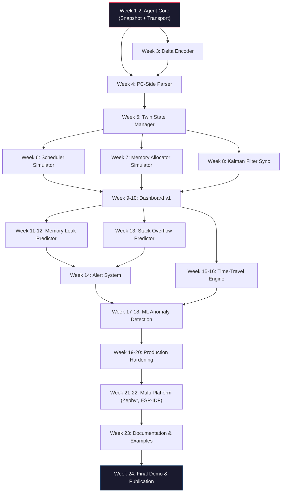

# RTOSTwin — Project Roadmap & Execution Blueprint

**Document Classification:** Engineering Roadmap (Staff-Level)  
**Authors:** Project Team  
**Date:** February 2026  
**Timeline:** 6 Months (180 engineering hours @ ~1 hr/day)  
**Target:** Production-grade RTOS Digital Twin Framework  

---

## 1. Strategic Context & Framing

### Why This Document Exists

Building a production-grade digital twin for real-time operating systems is not a single-threaded coding exercise. It is a systems engineering program. The architecture spans from bare-metal ISR handlers on a Cortex-M running at 168 MHz, through a framed binary protocol over UART, to a Kalman-filtered state estimator, ML anomaly detection, and a real-time web dashboard — all stitched together by invariants that must never break: **< 2% CPU overhead on the MCU**, **< 10 KB RAM footprint**, **< 1 ms synchronization lag when measured end-to-end**.

This roadmap exists to:

1. **Decompose** the system into deliverable work units that respect the dependency graph.
2. **Sequence** the work so that each week produces a testable artifact — no "underwater" multi-week integrations.
3. **Identify** the hard technical risks early and front-load mitigation.
4. **Define** verification gates — if a gate fails, we stop and fix before proceeding.

### Guiding Engineering Principles

| Principle | What It Means In Practice |
|---|---|
| **First-principles derivation** | Every design choice (sampling rate, buffer depth, protocol field width) must be traceable to a quantitative requirement. No magic numbers. |
| **Overhead is a first-class constraint** | We measure CPU cycles and RAM bytes for every module before merging. The agent is production firmware, not a debug tool. |
| **Incremental integration** | Week N's deliverable must compile, run, and pass automated tests *on its own* before Week N+1 begins. |
| **ISR-safety or bust** | Any code that touches shared state between a task and an ISR, or between the telemetry task and application tasks, must be provably safe — critical sections, lock-free queues, or disable/enable patterns. |
| **No dynamic allocation in the hot path** | The telemetry agent uses static allocation. `malloc` is forbidden inside `snapshot_capture()`, the delta encoder, and the transport task. |

---

## 2. System Dependency Graph

Understanding what depends on what is essential to avoid blocked work. The graph below shows the critical path.



**Critical Path:** Agent Core → Delta Encoder → PC Parser → Twin State Manager → Dashboard v1 → Predictive Analytics → Production Hardening → Final Demo

Any delay on the critical path directly delays the project end date. Non-critical items (e.g., Zephyr port) have float and can be deferred.

---

## 3. Phase Breakdown

---

### PHASE 1 — FOUNDATION (Weeks 1–4)

> **Objective:** Prove that a lightweight agent on an STM32F4 can capture RTOS state and stream it to a PC with measurable, acceptable overhead.

This phase is the **technical risk gate** for the entire project. If we cannot achieve < 5% CPU overhead for the snapshot + transmit cycle on a Cortex-M4 at 168 MHz, the fundamental premise of the project fails. We front-load the hardest constraint.

---

#### Week 1 — Agent Core: State Snapshot Engine

**Goal:** Capture a full RTOS state snapshot in a single, ISR-safe function call and print it over UART.

**What You Will Build:**
- `snapshot.h / snapshot.c` — The state capture module.
- Struct definitions for `task_snapshot_t`, `memory_snapshot_t`, `peripheral_snapshot_t`, `health_snapshot_t`, and the composite `full_snapshot_t`.
- A `snapshot_capture()` function that:
  - Reads `uxTaskGetSystemState()` to get task states, priorities, and stack high watermarks.
  - Reads `xPortGetFreeHeapSize()` and `xPortGetMinimumEverFreeHeapSize()` for memory state.
  - Reads GPIO registers and queue depths for peripheral state.
  - Calculates CPU utilization via the idle task hook method.
  - Computes a CRC-16 over the entire snapshot for integrity.
- A telemetry task (lowest priority above idle) that calls `snapshot_capture()` at 10 Hz and prints the result over UART.

**Engineering Depth — Why This Is Hard:**

1. **Atomicity Problem:** `uxTaskGetSystemState()` disables the scheduler (not interrupts) while copying task data. On an STM32F4 with 8 tasks, this takes approximately 15–25 µs. During this window, ISRs still fire, but no context switches occur. We must verify that no hard-deadline task is starved.

2. **Stack Watermark Accuracy:** FreeRTOS fills the stack with a sentinel pattern (`0xA5A5A5A5`) at creation. `uxTaskGetStackHighWaterMark()` scans from the bottom of the stack upward until it finds a non-sentinel word. This is O(n) in stack depth — on a 2 KB stack, that's up to 512 word comparisons. At 168 MHz, each comparison is ~3 cycles → 1536 cycles ≈ 9.1 µs per task. For 8 tasks: **73 µs** just for stack watermarks. This is a nontrivial cost that must be measured.

3. **malloc Inside Snapshot — The Trap:** The reference code in the report calls `malloc()` inside `snapshot_capture()` to allocate the `TaskStatus_t` array. **This is a critical bug.** `malloc` in FreeRTOS uses `pvPortMalloc`, which takes a mutex. If the telemetry task holds the heap mutex while a higher-priority task also calls `malloc`, you get priority inversion. The fix: **use a static buffer** (`static TaskStatus_t task_status_buffer[MAX_TASKS];`).

**Verification Gate (Must Pass Before Week 2):**
- [ ] `snapshot_capture()` executes in < 150 µs (measured via GPIO toggle + logic analyzer or `DWT->CYCCNT`).
- [ ] CPU overhead at 10 Hz: < 0.15% (150 µs × 10 = 1.5 ms out of 1000 ms).
- [ ] No `malloc/free` calls inside `snapshot_capture()`.
- [ ] Snapshot CRC validates correctly on the PC side (100% pass rate over 1000 snapshots).
- [ ] RTOS behavior unchanged (all application tasks meet their deadlines with agent running).

**Homework (Theoretical):**
1. Given an STM32F4 at 168 MHz with 8 tasks (average stack = 1 KB), derive the worst-case execution time of `snapshot_capture()` in CPU cycles. Account for: register reads, memory copies, CRC computation, and the scheduler suspend window.
2. Compute the maximum snapshot rate (Hz) that keeps total agent CPU overhead under 2%.

**Homework (Code):**
- Implement `snapshot_capture()` using only static allocation. Measure its execution time using the Cortex-M DWT cycle counter (`DWT->CYCCNT`). Report the result over UART.

---

#### Week 2 — Agent Core: Transport Layer & Packet Framing

**Goal:** Reliable, framed binary packet transmission over UART with integrity checking and loss detection.

**What You Will Build:**
- `transport.h / transport.c` — A packet framing and transmission module.
- Packet format: `[SYNC_0 | SYNC_1 | TYPE | SEQ_NUM | TIMESTAMP | LENGTH | PAYLOAD | CRC16]`
  - Sync bytes: `0xAA 0x55` (unlikely to appear in random data)
  - Sequence number: 16-bit, monotonically increasing — allows the receiver to detect dropped packets.
  - CRC-16-CCITT: Covers TYPE through end of PAYLOAD.
- A non-blocking circular transmit queue (`tx_queue[32]`).
- DMA-based UART transmission (zero CPU cost during byte transfer).
- A simple ACK/NAK protocol (receiver sends 1-byte ACK with the sequence number it received).

**Engineering Depth — Why This Is Hard:**

1. **Bandwidth Budget:** At 115200 baud (8N1), the theoretical throughput is 11,520 bytes/sec. A full snapshot is ~350 bytes. At 10 Hz, that's 3,500 bytes/sec — 30% of available UART bandwidth. With delta encoding (Week 3), this drops to ~200 bytes/sec (1.7%). This is why delta encoding is not optional — it's a bandwidth survival requirement.

2. **DMA vs. Polling vs. Interrupt:** Polling UART TX wastes CPU cycles waiting. Interrupt-driven TX triggers an ISR per byte (11,520 ISRs/sec at 115200 baud — significant ISR overhead). DMA TX: configure the DMA controller to write the entire packet buffer to the UART peripheral. CPU cost: one DMA setup call (~50 cycles) per packet. The UART peripheral and DMA engine do the rest in hardware. **DMA is the only acceptable approach for a production telemetry agent.**

3. **Byte Stuffing / Sync Collision:** If the payload naturally contains `0xAA 0x55`, the receiver might falsely detect a packet start. Mitigation: the receiver uses the LENGTH field to know exactly how many bytes to expect after the header, and validates CRC before accepting. False sync → CRC fail → discard.

**Verification Gate:**
- [ ] Packet loss rate < 0.1% over 10,000 packets at 115200 baud.
- [ ] DMA transfer verified (CPU does not spin during UART TX).
- [ ] CRC detects all single-bit and burst errors up to 16 bits.
- [ ] Sequence number gap detection works (artificially drop packets, verify receiver reports gaps).
- [ ] No heap allocation in the transmit path.

**Homework (Theoretical):**
1. Calculate the maximum snapshot rate (Hz) for a full 350-byte snapshot over 115200 baud UART, accounting for start/stop bits, inter-frame gaps, and ACK overhead.
2. Compare bandwidth utilization at 10 Hz with and without delta encoding (assuming average delta = 20 bytes).

**Homework (Code):**
- Implement the transmit queue as a lock-free circular buffer using `volatile` indices. Prove (in writing) that it is safe for single-producer (telemetry task), single-consumer (DMA completion ISR) access without mutexes.

---

#### Week 3 — Delta Encoder

**Goal:** Reduce telemetry bandwidth by 10–20× by transmitting only fields that changed since the last snapshot.

**What You Will Build:**
- `encoder.h / encoder.c` — Delta encoding module.
- A `changed_fields` bitmask (1 byte) indicating which top-level sections changed (tasks, memory, peripherals, health).
- For the task array: a per-task change bitmask — only send tasks whose state, priority, or stack usage changed.
- A `previous_snapshot` static buffer (the "reference frame"). Every Nth packet is a full "keyframe" (to allow the receiver to resynchronize after packet loss).

**Engineering Depth:**

1. **Compression Ratio Analysis:**
   - In steady state (no task changes, slow memory drift), only `health.cpu_utilization` and `memory.heap_free` change per cycle.
   - Delta packet: 1 byte (changed_fields) + 1 byte (cpu%) + 4 bytes (heap_free) + 2 bytes (CRC) = **8 bytes** vs. 350 bytes full. Ratio: **43.75×**.
   - In bursty state (task context switch), add ~30 bytes for changed tasks. Still 10×+ compression.

2. **Keyframe Strategy:** If we never send full snapshots, a single dropped delta makes the receiver permanently desynchronized. Solution: send a full "keyframe" snapshot every 10 seconds (or after detecting a sequence gap). This is analogous to I-frames in video encoding.

3. **memcmp Safety:** Comparing structs with `memcmp` in C is only safe if there is no padding. Use `__attribute__((packed))` or explicit field-by-field comparison.

**Verification Gate:**
- [ ] Average delta size < 30 bytes (measured over 1000 encoding cycles during steady-state operation).
- [ ] Receiver correctly reconstructs full state after a keyframe followed by 100 deltas.
- [ ] Receiver detects sequence gap and requests a keyframe.
- [ ] Encoding time < 20 µs per call.

---

#### Week 4 — PC-Side Receiver & Basic Dashboard

**Goal:** A Python script that receives the telemetry stream, decodes packets and deltas, and serves a basic web dashboard showing live task states and memory.

**What You Will Build:**
- `receiver.py` — Serial port listener, packet parser, delta decoder, and state reconstructor.
- `server.py` — Flask + Socket.IO web server that pushes state updates to the browser.
- `dashboard/index.html` — Minimal HTML/JS page showing:
  - Table of task names, states (Ready/Running/Blocked), priorities, and stack usage bars.
  - Memory bar chart (free vs. used heap, fragmentation indicator).
  - CPU utilization gauge.
  - Packet statistics (rate, loss %, last sequence number).

**🎬 MILESTONE DEMO 1:** A live dashboard updating at 10 Hz, reflecting the actual RTOS state of an STM32F4 running a multi-task FreeRTOS application. This is the "hello world" of the digital twin.

**Verification Gate:**
- [ ] Dashboard correctly reflects task state changes (suspend/resume a task → dashboard updates within 200 ms).
- [ ] Memory values match `xPortGetFreeHeapSize()` called directly on the device (within 1 sample latency).
- [ ] Packet loss is displayed and is < 0.1% over a 10-minute session.
- [ ] No browser memory leaks (dashboard can run for 1+ hour without degradation).

---

### PHASE 2 — DIGITAL TWIN ENGINE (Weeks 5–10)

> **Objective:** Build the host-side twin — a software model that mirrors RTOS kernel behavior, predicts states between telemetry updates using a Kalman filter, and presents a polished real-time dashboard.

---

#### Week 5 — Twin State Manager (C++ Core)

**Goal:** A C++ state database that ingests decoded snapshots and maintains the authoritative twin state with full time-series history.

**What You Will Build:**
- `state_manager.hpp / state_manager.cpp` — Central twin state store.
  - Stores the latest `TwinState` (equivalent to `full_snapshot_t` on the host).
  - Maintains a ring buffer of the last N states (configurable, default N = 3600 = 1 hour at 1 Hz storage rate).
  - Provides `get_state()`, `get_state_at(timestamp)`, `get_state_range(t_start, t_end)` queries.
  - Thread-safe: the synchronizer thread writes, the dashboard thread reads, the analytics threads read.

**Key Design Decision — Threading Model:**
- **Thread 1 (Receiver):** Reads serial port, parses packets, calls `state_manager.update(snapshot)`.
- **Thread 2 (Kalman):** Runs at 100 Hz, calls `state_manager.get_latest()` for the prediction step, overwrites twin state with filtered estimate.
- **Thread 3 (Dashboard):** Reads at 30 Hz for UI rendering.
- **Thread 4 (Analytics):** Runs at 1 Hz, reads historical data for trend analysis.

Synchronization: Read-write lock (`std::shared_mutex`). Writers (Thread 1, 2) take exclusive lock. Readers (Thread 3, 4) take shared lock. Low contention because writes are fast (< 1 µs memcpy).

**Verification Gate:**
- [ ] State manager handles 1000 updates/sec without lock contention stalls.
- [ ] Time-range queries return correct data (validated against known synthetic input).
- [ ] Ring buffer wraps correctly after N entries.

---

#### Week 6 — RTOS Scheduler Simulator

**Goal:** A software model of the FreeRTOS fixed-priority preemptive scheduler that can predict which task will run next.

**What You Will Build:**
- `scheduler_sim.hpp / scheduler_sim.cpp`
  - Models N tasks with priorities, states, and wakeup times.
  - `step(dt_us)` advances the simulation by dt microseconds:
    - Wakes blocked tasks whose timers expired.
    - Selects the highest-priority READY task as RUNNING.
    - Preempts the current task if a higher-priority task becomes READY.
    - Accumulates per-task CPU time.
  - `sync_with_snapshot(snapshot)` — Overrides simulator state with actual device state (ground truth).
  - `predict_state(future_time_us)` — Runs the simulator forward to predict future task states.

**Why This Matters:** Between telemetry samples (every 100 ms), the twin needs to predict what the RTOS is doing. The scheduler simulator fills the gaps. Without it, the dashboard would only update at 10 Hz — too slow for smooth visualization of context switches.

**Verification Gate:**
- [ ] Simulator correctly predicts next-task-to-run for a 4-task system with known priorities and periods.
- [ ] After `sync_with_snapshot()`, simulator state matches device state exactly.
- [ ] Prediction error < 5% for CPU utilization over a 10-second prediction window.

---

#### Week 7 — Memory Allocator Simulator

**Goal:** Model FreeRTOS heap dynamics to predict fragmentation and out-of-memory conditions.

**What You Will Build:**
- `memory_sim.hpp / memory_sim.cpp`
  - Models heap as a linked list of blocks (allocated / free), matching FreeRTOS `heap_4.c` (first-fit with coalescing).
  - Tracks allocation rate (`alloc_rate = Δallocated / Δtime`).
  - `predict(future_time_us)` returns `{free_bytes, largest_block, fragmentation_pct, time_to_oom}`.
  - `sync_with_snapshot(snapshot)` updates free/total values from real telemetry.

**Key Insight:** We don't need to model every individual `malloc/free` call (that's impossible without full instrumentation). Instead, we model the **aggregate trend** — free memory over time is a time series, and we use linear or exponential regression to forecast.

**Verification Gate:**
- [ ] Simulator predicts OOM time within ±10% for a controlled linear leak test.
- [ ] Fragmentation estimate is within ±5 percentage points of the actual value.

---

#### Week 8 — Kalman Filter Synchronizer

**Goal:** A Kalman filter that maintains a smooth, continuous twin state at 100 Hz using 10 Hz telemetry measurements.

**What You Will Build:**
- `synchronizer.hpp / synchronizer.cpp`
  - State vector: `[cpu_util, heap_free, task_0_stack, task_1_stack, ..., task_N_stack]`
  - Prediction model: identity (state doesn't change between measurements, but uncertainty grows).
  - Measurement model: identity (we directly measure the state via telemetry).
  - Process noise `Q`: Tuned to expected rate of change (e.g., CPU utilization can change ~5% per 100 ms).
  - Measurement noise `R`: Tuned to quantization noise of telemetry values.
  - Kalman gain: Automatically balances model trust vs. measurement trust.

**Why Kalman and Not Just "Use the Last Measurement":**

Scenario: Device sends `heap_free = 32000` at `t = 0`. Next measurement arrives at `t = 100 ms` with `heap_free = 31950`. If we just hold the last value, the dashboard shows a flat line at 32000 for 100 ms, then a sudden jump to 31950. The filter smoothly interpolates: at `t = 50 ms`, it estimates `~31975` with appropriate uncertainty bounds. This gives the user a smooth, physically plausible state trajectory.

**Verification Gate:**
- [ ] Filtered state is smoother than raw telemetry (lower variance).
- [ ] When a measurement arrives, the filter snaps to within 1% of the true value within 2 update cycles.
- [ ] Filter runs at 100 Hz with < 0.5 ms compute time per step.

---

#### Weeks 9–10 — Dashboard v2 (Production Quality)

**Goal:** A real-time web dashboard with task timeline, memory prediction graph, CPU heatmap, and alert panel.

**What You Will Build:**
- **Task Timeline (Gantt Chart):** Canvas-based, shows per-task execution windows as colored bars. Running = green, Blocked = gray, Ready = yellow.
- **Memory Graph with Forecast:** Plotly line chart showing actual heap_free (solid blue) and predicted future (dashed red) with a confidence interval shaded region. If the prediction crosses zero, draw a vertical "OOM" line with a timestamp.
- **CPU Utilization Gauge / Heatmap:** Per-task CPU% as a stacked bar. Color-coded: green (< 50%), yellow (50–80%), red (> 80%).
- **Stack Usage Bars:** Per-task horizontal bars showing stack used / stack total. Red zone above 80%.
- **Alert Panel:** Prioritized list of active alerts (memory leak, stack risk, anomaly).
- **Time-Travel Slider:** A scrubber at the bottom to navigate historical states.

**🎬 MILESTONE DEMO 2:** Full dashboard with live telemetry, prediction overlays, and a polished UI. This is the "wow" demo.

**Verification Gate:**
- [ ] Dashboard renders at ≥ 30 FPS with 8 tasks and 10 Hz updates.
- [ ] Memory prediction graph correctly shows OOM forecast when a leak is injected.
- [ ] Stack bars update correctly when a task's recursion depth changes.
- [ ] Dashboard can run for 8+ hours without memory leaks or crashes.

---

### PHASE 3 — PREDICTIVE ANALYTICS (Weeks 11–16)

> **Objective:** Move from mirroring to prediction — detect memory leaks, forecast stack overflows, and enable time-travel debugging.

---

#### Weeks 11–12 — Memory Leak Detector

**Goal:** A Python analytics module that detects memory leaks with > 90% accuracy and predicts time-to-OOM.

**What You Will Build:**
- `leak_detector.py`
  - Collects `heap_free` time series from the twin state manager.
  - Sliding window linear regression (scipy `linregress`) over configurable window (default 10 minutes).
  - Leak detection criteria: slope < -10 bytes/sec, R² > 0.8, p-value < 0.01.
  - Time-to-OOM calculation: `current_free / |slope|`.
  - Advanced: seasonal decomposition for periodic workloads (e.g., memory usage cycles with a diurnal pattern).

**Validation Strategy:**

Create three synthetic test scenarios on the device:

| Scenario | Behavior | Expected Detection |
|---|---|---|
| **Steady state** | No leak, heap_free fluctuates ±100 bytes | No alert |
| **Slow leak** | 10 bytes/sec leak (malloc without free in a periodic task) | Alert within 10 minutes, OOM prediction within ±15% |
| **Burst allocation** | Large allocation then free (sawtooth pattern) | No false positive |

**Verification Gate:**
- [ ] Detects a 50 bytes/sec leak within 5 minutes of onset.
- [ ] OOM prediction is within ±20% of actual OOM time.
- [ ] Zero false positives on a 1-hour steady-state run.
- [ ] Zero false positives on a sawtooth allocation pattern.

---

#### Week 13 — Stack Overflow Predictor

**Goal:** Predict stack overflows before they cause memory corruption, using high-watermark trend analysis.

**What You Will Build:**
- `stack_predictor.py`
  - Tracks `stack_used / stack_total` per task over time.
  - Risk classification: LOW (< 70%), MEDIUM (70–80%), HIGH (80–90%), CRITICAL (> 90%).
  - Polynomial regression (degree 2) on stack usage history to predict future usage.
  - Alert if predicted usage crosses `stack_total` within a configurable horizon (default 1 hour).

**Why Polynomial (Not Linear):** Stack usage often grows non-linearly — for example, a recursive function's maximum depth increases as input data grows. A linear model would underestimate the growth rate and miss the overflow.

**Verification Gate:**
- [ ] Correctly classifies a task at 85% stack usage as HIGH risk.
- [ ] Predicts overflow within ±30 minutes for a linearly growing stack.
- [ ] No false positives on tasks with stable stack usage over 1 hour.

---

#### Week 14 — Alert System & Integration

**Goal:** A unified alert engine that aggregates predictions from all analytics modules and presents them on the dashboard.

**What You Will Build:**
- `alert_engine.py`
  - Subscribes to leak detector, stack predictor, and (later) anomaly detector.
  - Alert deduplication: don't fire the same alert every second. Use a cooldown period (default 5 minutes).
  - Severity levels: INFO, WARNING, CRITICAL.
  - WebSocket push to dashboard.
  - Persistent alert log (SQLite or JSON file) for historical analysis.

**Verification Gate:**
- [ ] Alert fires within 30 seconds of a prediction threshold being crossed.
- [ ] Duplicate suppression works (only 1 alert per cooldown period).
- [ ] Alert clears automatically when the condition resolves (e.g., memory freed).

---

#### Weeks 15–16 — Time-Travel Debugging Engine

**Goal:** Record full twin state at 1 kHz to a circular buffer, enabling "rewind" to any timestamp in the last 60 seconds.

**What You Will Build:**
- `recorder.hpp / recorder.cpp`
  - Ring buffer of 60,000 `StateRecord` entries (60 seconds at 1 kHz).
  - `record(snapshot)` writes to the buffer (O(1), constant time).
  - `find_timestamp(target_time)` binary searches the buffer for the closest entry.
  - `replay(start_time, end_time, speed)` plays back a range of states to the dashboard at configurable speed (1×, 0.5×, 0.1× for slow-motion).
  - `save_to_disk(filename)` serializes the buffer for offline analysis.
  - `find_condition(lambda)` — searches for the first state matching a condition (e.g., "CPU > 90%").

**Use Case — Post-Crash Root Cause Analysis:**

1. System crashes at `t = 120.456s`.
2. Rewind to `t = 110s` (10 seconds before crash).
3. Replay in slow motion. Observe:
   - `t = 118.2s`: Task A's stack hits 95%.
   - `t = 119.8s`: Task A enters a deep recursive call path.
   - `t = 120.1s`: Stack overflow → memory corruption → crash at `t = 120.456s`.
4. Root cause identified without needing to reproduce the bug.

**Verification Gate:**
- [ ] Buffer correctly wraps after 60,000 entries.
- [ ] `find_timestamp()` returns the correct entry for edge cases (first entry, last entry, exact match, interpolated).
- [ ] Replay at 0.1× speed produces a smooth, accurate slow-motion view on the dashboard.
- [ ] `save_to_disk()` + `load_from_disk()` round-trips without data loss.

---

### PHASE 4 — ML & HARDENING (Weeks 17–22)

> **Objective:** Add machine-learning-based anomaly detection, harden the system to production quality, and port to additional platforms.

---

#### Weeks 17–18 — ML Anomaly Detection

**Goal:** An Isolation Forest model that detects operational anomalies the rule-based predictors cannot catch.

**What You Will Build:**
- `anomaly_ml.py`
  - Feature extraction: `[cpu%, heap_free%, frag%, interrupt_rate, temp, per_task_stack%]`.
  - Training: Collect 24–48 hours of "normal" operation data. Fit `IsolationForest(contamination=0.01)`.
  - Inference: Score each new snapshot. If score is an outlier (< decision threshold), flag as anomaly.
  - Explainability: For each anomaly, compute per-feature z-scores against the training distribution. Report which features deviated most (e.g., "CPU utilization 3.2σ above normal, interrupt rate 4.1σ above normal → possible interrupt storm").

**Why Isolation Forest (Not Neural Network):**
- Works with small training sets (hours, not weeks).
- Interpretable (feature importance via z-scores).
- Fast inference (< 1 ms per sample).
- No GPU required.
- Embedded-friendly (scikit-learn, no TensorFlow dependency for inference).

**Verification Gate:**
- [ ] Correctly detects an injected interrupt storm (artificially doubled interrupt rate) as anomalous.
- [ ] Does not flag normal operation as anomalous (< 1% false positive rate on a 1-hour test).
- [ ] Explanation correctly identifies the anomalous feature(s).

---

#### Weeks 19–20 — Production Hardening

**Goal:** Optimize the agent to meet the < 2% CPU, < 10 KB RAM production target. Comprehensive test suite.

**What You Will Do:**
- **Agent Optimization:**
  - Profile every function with `DWT->CYCCNT`. Identify and eliminate any call exceeding 50 µs.
  - Verify zero dynamic allocation via static analysis (or `--wrap=malloc` linker trick to catch at runtime).
  - Reduce agent RAM by packing structs, using `uint8_t` where `uint32_t` is wasted.
  - Measure total footprint: target < 8.5 KB RAM, < 18 KB flash.

- **Test Suite (Target: 100+ Tests):**

| Layer | Test Type | Count | Tool |
|---|---|---|---|
| Agent (C) | Unit tests (snapshot, encoder, transport) | 30+ | Unity test framework |
| Twin (C++) | Unit tests (state manager, scheduler sim, memory sim, Kalman) | 30+ | Google Test |
| Analytics (Python) | Unit tests (leak detector, stack predictor, anomaly detector) | 20+ | pytest |
| End-to-end | Integration tests (device → dashboard) | 10+ | Custom harness |
| Stress | Sustained 8-hour run, packet loss injection, high-load scenarios | 10+ | Custom scripts |

- **Performance Regression Tests:** Automated CI that runs overhead measurement on every commit. If CPU overhead exceeds 2%, the build fails.

**Verification Gate:**
- [ ] Agent overhead: < 2% CPU, < 10 KB RAM (measured, not estimated).
- [ ] All 100+ tests pass.
- [ ] 8-hour sustained run with zero crashes, zero memory leaks, zero assertion failures.
- [ ] Agent works on Cortex-M0+ with 32 KB RAM (minimum viable target).

---

#### Weeks 21–22 — Multi-Platform Support

**Goal:** Port the telemetry agent to Zephyr RTOS and ESP-IDF, validating the abstraction layer.

**What You Will Build:**
- `rtos/zephyr_hooks.c` — Zephyr-specific implementations:
  - Task state capture via `k_thread_foreach()`.
  - Memory via `k_mem_slab_num_free_get()` and `k_heap_runtime_stats_get()`.
  - Stack via `k_thread_stack_space_get()`.
- `rtos/esp_idf_hooks.c` — ESP-IDF-specific implementations:
  - Task state via `uxTaskGetSystemState()` (same FreeRTOS API, different port).
  - Memory via `esp_get_free_heap_size()`.
  - USB CDC or UDP transport (instead of a UART-only assumption).
- **HAL Abstraction:** The core `snapshot.c` and `encoder.c` call platform-agnostic functions (`rtos_get_task_count()`, `rtos_get_free_heap()`, etc.) that are implemented per platform.

**Verification Gate:**
- [ ] Same dashboard works unmodified with `NUCLEO-F401RE`, `ESP32-P4`, and `Teensy 4.1` devices.
- [ ] Overhead targets met on all three platforms.
- [ ] No `#ifdef` spaghetti — clean HAL separation.

---

### PHASE 5 — DOCUMENTATION & LAUNCH (Weeks 23–24)

> **Objective:** Professional documentation, example applications, demo video, and conference paper submission.

---

#### Week 23 — Documentation & Examples

**What You Will Build:**
- **API Reference:** Doxygen-generated documentation for the C agent API and C++ twin API.
- **Quick Start Guide:** 5-minute setup (flash agent → run twin → open dashboard).
- **Tutorials:**
  - "Your First Digital Twin" (blinky LED + twin)
  - "Adding Custom Metrics" (extend snapshot struct)
  - "Writing a Predictor Plugin" (custom analytics module)
- **Example Applications:**
  - `examples/blinky_twin/` — Minimal hello world.
  - `examples/sensor_system/` — Multi-task sensor fusion with 4 tasks.
  - `examples/industrial_motor/` — Production use case with leak injection and prediction.

---

#### Week 24 — Final Demo & Publication

**What You Will Deliver:**
- **🎬 FINAL DEMO VIDEO** (3–5 minutes):
  1. Show the physical device running with the dashboard.
  2. Inject a memory leak → dashboard predicts OOM 6 hours early.
  3. Inject a stack-heavy workload → dashboard warns of overflow risk.
  4. Trigger an anomaly (interrupt storm) → ML model flags it.
  5. Use time-travel to rewind and analyze the event.
  6. Show multi-platform (`NUCLEO-F401RE`, `ESP32-P4`, and `Teensy 4.1`) on the same dashboard.
- **Technical Blog Post:** 2000-word article for Embedded.com or similar.
- **Conference Paper Draft:** Target IEEE Embedded Systems Letters or ACM TECS.
- **GitHub Release:** Tagged v1.0.0 with README, LICENSE (MIT), CHANGELOG, and CI badges.

---

## 4. Risk Register

| # | Risk | Likelihood | Impact | Mitigation |
|---|---|---|---|---|
| R1 | Agent overhead exceeds 2% on Cortex-M0+ | Medium | Critical | Profile weekly from Week 1. Use DWT cycle counter. Reduce snapshot rate if needed. |
| R2 | Delta encoding doesn't compress enough | Low | High | Keyframe-only mode as fallback. Reduce snapshot field count. |
| R3 | Kalman filter diverges (bad tuning) | Medium | Medium | Start with conservative Q/R values. Add filter reset on large innovations. |
| R4 | ML anomaly detector has high false positive rate | Medium | Medium | Start with conservative contamination=0.005. Require 3 consecutive anomalous samples before alerting. |
| R5 | UART DMA conflicts with application DMA | Medium | High | Reserve a dedicated DMA channel for telemetry. Verify no channel conflicts in CubeMX. |
| R6 | Multi-platform port takes longer than 2 weeks | High | Low | `ESP32-P4` and `Teensy 4.1` follow only after the `NUCLEO-F401RE` baseline is stable. |
| R7 | Dashboard performance degrades with 8+ hours of data | Medium | Medium | Implement data downsampling for historical view. Only render the visible window. |

---

## 5. Hardware & Software Requirements

### Hardware (Total: ~$108)

| Item | Purpose | Est. Cost |
|---|---|---|
| STM32F4 Discovery / Nucleo | Primary development board (Cortex-M4, 168 MHz, 192 KB RAM) | $25 |
| ESP32-P4-Function-EV-Board | USB CDC / Ethernet connectivity test, flagship platform | $35-50 |
| Teensy 4.1 | High-performance USB CDC platform | $27-35 |
| USB-UART Adapter (CP2102/FTDI) | Initial serial comms | $8 |
| Saleae-compatible Logic Analyzer | Protocol debugging, timing measurement | $20 |

### Software Stack

| Layer | Technology | Justification |
|---|---|---|
| Agent (Embedded) | C99, FreeRTOS 10.5+, STM32 HAL | Industry standard. MISRA-C compatible. |
| Agent (board expansion) | C99, FreeRTOS + board-specific BSPs | Validates the shared protocol, platform, and transport layering across the three demo boards. |
| Twin Core | C++17 | Performance-critical state management and simulation. |
| Analytics | Python 3.9+, scikit-learn, scipy, numpy | Rapid prototyping of ML models. |
| Dashboard Backend | Node.js 18+, Express, Socket.IO | Real-time WebSocket support. |
| Dashboard Frontend | React 18, TypeScript, Plotly.js, Three.js | Rich interactive visualizations. |
| Build System | CMake (agent), pip (analytics), npm (dashboard) | Cross-platform, standard tooling. |
| Testing | Unity (C), Google Test (C++), pytest (Python) | Standard frameworks per language. |
| CI/CD | GitHub Actions | Automated build, test, overhead measurement. |

---

## 6. Directory Structure

```
RTOSTwin/
├── agent/                          # Embedded device firmware (C99)
│   ├── core/
│   │   ├── snapshot.h / snapshot.c       # State capture
│   │   ├── encoder.h / encoder.c        # Delta encoding
│   │   └── transport.h / transport.c    # Packet framing & DMA TX
│   ├── rtos/
│   │   ├── freertos_hooks.c             # FreeRTOS trace hooks
│   │   ├── zephyr_hooks.c              # Zephyr integration
│   │   └── esp_idf_hooks.c            # ESP-IDF integration
│   ├── hal/
│   │   ├── stm32/                       # STM32 HAL wrappers
│   │   ├── esp32/                       # ESP32 HAL wrappers
│   │   └── imxrt1062/                   # Teensy 4.1 / i.MX RT1062 HAL wrappers
│   └── tests/                           # Unity unit tests
│
├── twin/                           # Digital twin host software
│   ├── core/
│   │   ├── state_manager.hpp/.cpp       # Twin state database
│   │   ├── synchronizer.hpp/.cpp        # Kalman filter
│   │   └── decoder.hpp/.cpp             # Delta decoding
│   ├── simulator/
│   │   ├── scheduler_sim.hpp/.cpp       # RTOS scheduler model
│   │   ├── memory_sim.hpp/.cpp          # Heap simulator
│   │   └── peripheral_sim.hpp/.cpp      # GPIO/UART/I2C models
│   ├── analytics/
│   │   ├── leak_detector.py             # Memory leak prediction
│   │   ├── stack_predictor.py           # Stack overflow prediction
│   │   ├── anomaly_ml.py               # Isolation Forest detector
│   │   └── alert_engine.py             # Unified alert system
│   ├── recorder/
│   │   ├── time_travel.hpp/.cpp         # Circular buffer recorder
│   │   └── replay_engine.hpp/.cpp       # Replay & what-if
│   └── tests/                           # Google Test suite
│
├── dashboard/                      # Web UI
│   ├── frontend/                        # React + TypeScript
│   └── backend/                         # Node.js + Socket.IO
│
├── examples/                       # Reference implementations
│   ├── blinky_twin/                     # Hello world
│   ├── sensor_system/                   # Multi-task example
│   └── industrial_motor/               # Production use case
│
├── docs/                           # Documentation
│   ├── api/                             # Doxygen output
│   ├── tutorials/                       # Step-by-step guides
│   └── architecture/                    # Design documents
│
├── homework/                       # Learning exercises
│   ├── theoretical/                     # Math & analysis
│   └── code/                            # Implementation tasks
│
├── notes/                          # Key learning summaries
│
└── tools/                          # Dev utilities
    ├── config_generator/                # Agent config tool
    ├── test_scenarios/                  # Pre-built test scripts
    └── overhead_profiler/              # CI overhead measurement
```

---

## 7. Weekly Milestone Summary

| Week | Deliverable | Key Metric | Demo? |
|---|---|---|---|
| 1 | Agent snapshot engine | < 150 µs execution time | — |
| 2 | Transport layer with DMA | < 0.1% packet loss | — |
| 3 | Delta encoder | 10–40× compression | — |
| 4 | PC receiver + basic dashboard | Live dashboard at 10 Hz | **🎬 Demo 1** |
| 5 | Twin state manager (C++) | 1000 updates/sec capacity | — |
| 6 | Scheduler simulator | < 5% prediction error | — |
| 7 | Memory allocator simulator | OOM prediction ±10% | — |
| 8 | Kalman filter synchronizer | Smooth 100 Hz twin state | — |
| 9–10 | Dashboard v2 (production) | 30 FPS, all panels | **🎬 Demo 2** |
| 11–12 | Memory leak detector | > 90% accuracy, 0 false positives | — |
| 13 | Stack overflow predictor | Correct risk classification | — |
| 14 | Alert system | < 30 sec alert latency | — |
| 15–16 | Time-travel debugger | 60-sec rewind, slow-motion replay | **🎬 Demo 3** |
| 17–18 | ML anomaly detection | < 1% false positive rate | — |
| 19–20 | Production hardening | < 2% CPU, 100+ tests pass | — |
| 21–22 | Multi-platform (Zephyr, ESP) | Same dashboard, 3 platforms | — |
| 23 | Documentation & examples | Quick start + 3 tutorials | — |
| 24 | Final demo & publication | Video, blog, paper draft | **🎬 Final Demo** |

---

## 8. Success Criteria (End of Month 6)

### Technical Gates (All Must Pass)

- [ ] Twin synchronization lag < 1 ms (measured).
- [ ] Agent overhead < 2% CPU on STM32F4 at 168 MHz.
- [ ] Agent RAM footprint < 10 KB.
- [ ] Memory leak prediction accuracy > 90%.
- [ ] Stack overflow prediction accuracy > 85%.
- [ ] Zero false positives on anomaly detection over 24-hour steady-state run.
- [ ] Time-travel rewind covers last 60 seconds at 1 kHz resolution.
- [ ] Dashboard runs 8+ hours without degradation.
- [ ] 100+ automated tests passing.
- [ ] Works on at least 2 RTOS platforms (FreeRTOS + Zephyr or ESP-IDF).

### Deliverable Gates

- [ ] GitHub repository with MIT license, CI, and documentation.
- [ ] 3 example applications (blinky, sensor, industrial).
- [ ] 3–5 minute demo video showing all major features.
- [ ] Technical blog post (2000+ words).
- [ ] Conference paper draft (IEEE ESL or ACM TECS format).

---

## 9. What Comes Next (Post v1.0 — Future Scope)

These items are explicitly **out of scope** for the 6-month v1.0 timeline but represent the natural evolution:

1. **Fleet Management Dashboard:** Monitor 100+ devices from a single view. Requires cloud backend (AWS/GCP), device registry, and fleet-level analytics.

2. **Cognitive Twin (Level 3):** The twin autonomously triggers corrective actions (e.g., restarting a leaking task, adjusting priorities to prevent starvation). Requires formal verification of safety properties.

3. **Thermal Modeling:** Physics-based temperature prediction using thermal resistance models and power dissipation estimates. Relevant for automotive BMS and industrial motor drives.

4. **OTA Update Validation:** Before deploying a firmware update to a fleet, run the new firmware on the digital twin and compare behavioral fingerprints. Only push the update if the twin validates that key invariants hold.

5. **MISRA-C Compliance:** Formal MISRA-C:2012 compliance for the agent code, enabling use in automotive (ISO 26262) and medical (IEC 62304) safety-critical systems.

6. **VS Code / IDE Plugin:** Embed the dashboard directly into the developer's IDE for seamless debugging workflow.

---

*"The best firmware engineers don't debug — they design systems that are observable by construction. RTOSTwin makes that possible."*

---

**END OF ROADMAP**
